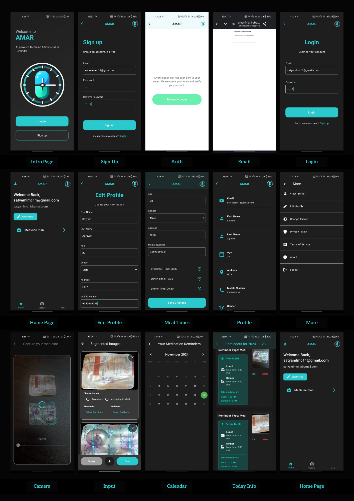

# AI Powered Medicine Administration Reminder (AMAR) App  

**AMAR** is an AI-powered application designed to assist patients in managing their medication schedules effectively. The app leverages image-based reminders, segmentation techniques to provide detailed medicine reminders, ensuring improved medication adherence.

## Features  
- **Image-Based Medicine Identification**: Nurses or caretakers can upload images of prescribed medicines for automatic segmentation and recognition.  
- **Customizable Reminders**: Set reminders for specific times and frequencies.  
- **Patient Feedback Tracking**: Patients can log their medicine intake, enabling doctors to monitor adherence.  
- **AI-Powered Enhancements**: Leveraging AI for image segmentation and context reminders.

---

## Video Demonstration
The video demonstration can be accessed from https://drive.google.com/file/d/1tl5_hMRzt-vyQ8m3LBnvOt4VyHrcImw8/view?usp=sharing


## Screenshots  


---

## Installation  

Follow these steps to set up the Medical Reminder App locally:  

### Prerequisites  
Ensure you have the following installed:  
- **Flutter**: [Install Flutter](https://flutter.dev/docs/get-started/install)  
- **Dart SDK**: Comes with Flutter.  
- **Android Studio** or **Visual Studio Code** for development and emulators.  
- **Git**: [Install Git](https://git-scm.com/book/en/v2/Getting-Started-Installing-Git)  
- **Python (for backend AI models)**: [Download Python](https://www.python.org/downloads/)  

### Clone the Repository  
```bash  
git clone https://github.com/saliq5/AMAR---AIH_IT469_COURSE_PROJECT
```  

---

### Frontend Setup  

1. Install Flutter dependencies:  
   ```bash  
   flutter pub get  
   ```

2. Rebuild the app:
   Run the following command to build the app for your target platform (Android/iOS):

   ```bash
   flutter build <platform>  # Example: flutter build apk for Android
   ```

3. Run the app on an emulator or physical device:  
   ```bash  
   flutter run  
   ```  

---

### Backend Setup  

1. **Python Virtual Environment** (optional but recommended):  
   ```bash  
   python -m venv venv  
   source venv/bin/activate  # On Windows, use `venv\Scripts\activate`  
   ```  

2. Install Python dependencies:  
   ```bash  
   pip install -r requirements.txt  
   ```  

3. Start the backend server (if required):  
   ```bash  
   python server.py  
   ```  

---

### Connecting Frontend and Backend  

Ensure the backend API is running, and update the API base URL in the Flutter app under `lib/camera.dart`:  
```dart  
final uri = Uri.parse("http://<your-backend-host>:<port>");  
```  

---

## Acknowledgements  

- Dr. Sowmya Kamath (Faculty for IT469)
- Dr. Raghunandan Agrawal (M.S.)
- Flutter community
